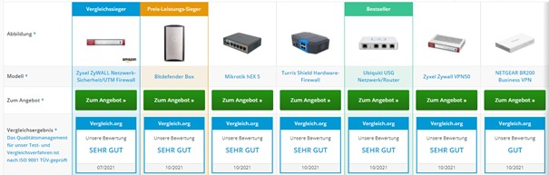

# TBZ_Modul_146
**Gruppe: Sharon, Luca, Eric**

<h1>Firewall</h1> 

<h2>Ausgangslage/Ist-Situation</h2>

Ein Unternehmen hat einen veralteten Internetzugang mit einer Übertragungsrate von 50 Mbit/s im Download und 5 Mbit/s im Upload mit ADSL. Die Firma produziert Kaffeemaschinen in einer städtischen Gegend in der Schweiz. Das Marketing benutzt moderne Webapplikationen mit viel Multimediaanwendungen und ein Shop für Endkunden ist ebenfalls vorhanden. Alle Mitarbei-tenden benutzen Mail und Browserapplikationen. Die Firma hat 90 Internetnutzer.
Eine Firewall ist nicht vorhanden und die Server stehen alle beim Provider.

<h3>Aufgabenstellung:</h3>  

Vergleichen Sie für einen Internetanschluss folgende Firewall-Lösungen:  

• Günstige Hardware-Firewalls (Cisco-ASA, Zyxel Zywall oder ähnliche) 
• PC-Lösung mit Linux 
• Firewall-Service des Providers. 

Welche Vergleichskriterien finden Sie, welche sind für welche Einsatzfälle wie wichtig? 

Konstruieren Sie „typische Fälle“ und vergleichen Sie.

---

<h2>Firewall</h2>
Eine Firewall ist essentiell und es ist nur eine Frage der Zeit bis ein ungebetener Gast sich im eigenen Netzwerk umschaut, es führt also kein Weg an einer Firewall vorbei. Es gibt drei Arten von Firewall lösungen: Hardware-Firewalls, PC Lösungen und Firewall Services vom eigenen Provider z.B. Diese werden hier anschliessend verglichen. 6.1.Günstige Hardware-Firewalls Palo Alto ist im Bereich Netzwerksicherheit eine der Marktführenden Firmen. Es gibt sehr viele unterschiedliche Firewall Lösungen welche sie anbieten, für KMUs und Enterprise. Ich empfehle die PA-3020 Firewall. Diese NGFW hat einen Durchsatz von über 2 Gbit/s, unterstützt mehrere VLANs, und bietet eine eigene VPN Lösung.
Anforderungen
- Glasfaser Kabel

 
<h2>Optional</h2>
- Serverrack
PC-Lösung mit Linux
OPNsense ist eine Open Source Firewall Lösung welche für FreeBSD entwickelt wurde und somit auch auf Linux läuft. Es werden Multi WAN, VPN, 2FA und viele weitere nützliche Features unterstützt. Der grosse Vorteil an OPNsense ist, dass es Open Source ist und es sich so zu 100% auf eigene Bedürfnisse anpassen. Ausserdem bietet OPNsense wöchentliche kostenlose Sicherheitsupdates.
Anforderungen
- Server mit FC Anschluss
- Glasfaser Kabel
- Linux als OS

<h2>Firewall-Service des Providers</h2>
Jeder Internet Provider hat bereits seine eigene Firewall. Damit kann man einen gewissen Teil der Viren bereits abfangen. Diese Art von Firewalls bieten den Vorteil, dass man sich um nichts kümmern muss bzw. Einstellungen nicht selbstständig vornehmen muss sondern alles bei Provider in Auftrag geben kann. Ein Nachteil ist aber, man kann Änderungen nicht selbst vornehmen und somit muss man immer warten bis der Provider die Änderung vorgenommen hat.

