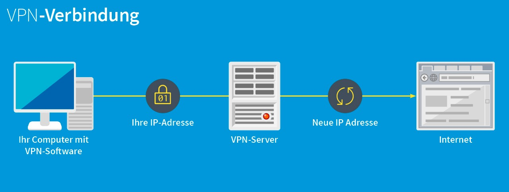

# TBZ_Modul_146
**Gruppe: Sharon, Luca, Eric**

<h1>VPN</h1>

<h2>Ausgangslage/Ist-Situation</h2>

Ein Unternehmen hat einen veralteten Internetzugang mit einer Übertragungsrate von 50 Mbit/s im Download und 5 Mbit/s im Upload mit ADSL. Die Firma produziert Kaffeemaschinen in einer städtischen Gegend in der Schweiz. Das Marketing benutzt moderne Webapplikationen mit viel Multimediaanwendungen und ein Shop für Endkunden ist ebenfalls vorhanden. Alle Mitarbei-tenden benutzen Mail und Browserapplikationen. Die Firma hat 90 Internetnutzer.
Eine Firewall ist nicht vorhanden und die Server stehen alle beim Provider.

<h3>Aufgabenstellung:</h3>  

Vergleichen Sie folgende VPN-Lösungen für ihren Internetanschluss:  

- Hardwarelösung (Cisco-ASA oder Ähnliches) 
- VPN-Service des Providers 
- PC-Lösung mit Windows und Linux.  

Welche Vergleichskriterien finden Sie, welche sind für welche Einsatzfälle wie wichtig? 

Diskutieren Sie einige „typische Fälle“ und vergleichen Sie. 

---

### <b>Was ist VPN?</b> 
VPN steht für Virtual Private Network und ist ein sicherer Kanal durchs Internet.
Diese Technologie maskiert die Identität des Gerätes und verschlüsselt alle gesendeten Daten im Internet. So können verschlüsselte Verbindungen zwischen Gerät und Server erstellt werden, oder zwischen Gerät und Netzwerk sowie auch zwischen zwei Netwerken.

Unternehmen benutzen diese Technologie wegen folgenden Gründen:
* Remote-Mitarbeiter 👩‍💻
* Zusätzliche Sicherheitsschicht 🔐
* Mitarbeiter, die für Ihr Unternehmen reisen ✈️
* BYOD-Richtlinie 🐱‍💻
* Vermeiden von geografischen Einschränkungen 🚫
* Budgetfreundlich 💰

### <b>Hardwarelösung</b> 
Nebst einfache Software VPN Lösungen, gibt es auch ganze Hardware für VPN Verbindungen.
Wenn man eine Verbindung zu einem Büro aufbauen will, braucht man ein VPN-fähiges Gerät ("VPN-Gateway") an diesem Ort.
Solche Geräte sind in der Regel eine Firewall mit VPN-Funktion.

Das VPN Gateway muss mit dem Internet verbunden sein und sollte am besten eine statische öffentliche IP-Adresse haben oder einen dynamischen DNS eintrag.

Es gibt auch VPN-Router, dies sind im Prinzip einfache Router die eine VPN-Funktion haben, mitdem sich ganze Netzwerke über VPN verbinden lassen.
Solche Router gibt es auch für den Privatgebrauch.

Für eine kleine bis mittlere Firma reichen auch VPN-Router, nach einer gewissen Netzwerkgrösse wäre eine eigene Hardware für den VPN am besten.

Zyxel sowie auch Cisco bieten verschieden VPN Hardware Lösungen mit verschiedenen Geschwindigkeiten und Funktionen.  

<b>Hardwarevergleich:</b> 

Cisco Gigabit Dual WAN VPN |
----------------------|

Cisco bietet viele grossartige Geräte an, einschliesslich seines Gigabit Dual WAN VPN.
Dieses Gerät bietet 14 verschiedene LAN-Ports und verfügt über zwei Gigabit-Ethernet-WAN-Ports für den Lastausgleich.

* 14 LAN ports
* Eingebaute SSL (Secure Socket Layer) und SPI (Stateful Pocket Inspection) Firewall.
* Verwaltet mehrere Benutzer gleichzeitig
* Bietet eine Datenübertragungsrate von 100 Mbit/s.
* Kommt mit erweiterter IP-Sicherheit.
* Einfach einzurichten, da es mit einem intuitiven GUI-Setup-Assistenten geliefert wird, der Ihnen den Einstieg erleichtert.
* Garantie: 90 Tage.

Zyxel Zywall VPN-Firewall |
----------------------|

Zyxel bietet eines der sicherstesn VPN-Geräten auf dem Markt an und eine grossartige Wahl für mittlere bis zu grossen Unternemhen, da es bis zu 1000 Benutzer unsterstützt. Das Beste ist, dass diese VPN-Hardware mit einer Vielzahl von Geräten kompatibel ist und L2TP-Unterstützung für Android-, iOS- und Windows-Geräte bietet.

* Multi-Core-CPU mit bis zu 3,6 Lücken Firewall
* 8 Gibe-Ports mit hohem Durchsatz
* ermöglicht 500.000 Sitzungen
* Neben IPSec bietet es auch IPv6- und VLAN-Unterstützung
* Bietet SHA-3-Verschlüsselung
* 1000 IPSec VPN-Sicherheitsverbindungen
* VPN-Hochverfügbarkeit (HA) mit Dual-WAN-Failover und Fallback-Unterstützung
* Load-Balancing zur Erhöhung der Bandbreite
* 250 SSL-VPN-Tunnel für Remote-Mitarbeiter.
* Garantie: 2 Jahre

GL.iNet GL-AR150 |
----------------------|

Das Mini-Reise-VPN-Gerät von GL.iNet ist eine erstaunliche Option für Benutzer, die ein erschwingliches Hardwaregerät für kleine Unternehmen und Privathaushalte suchen. Es ist leicht und einfach zu transportieren, sodass man es überall hin mitnehmen kann und nach Bedürfniss verwenden kann.

* Eingebauter OpenVPN- und TOR-Client
* Kompatibel mit über 30 VPN-Diensten
* Wiegt nur 1,41 oz
* Duale Ethernet-Ports
* 64 MB RAM und 16 MB Flash-ROM
* Kann es mit einer Powerbank oder deren Adapter verwenden.

Linksys Business Dual WAN VPN Device|
----------------------|

Diese VPN-Hardware ist eine großartige Option für kleine und mittlere Unternehmen. Es bietet eine hervorragende Datenübertragungsrate von 1000 Mbit/s und Site-to-Site-VPN-Unterstützung für Ethernet-Konnektivität. Hier sind einige seiner Unterscheidungsmerkmale:

* Bis zu 50 IPSec-Tunnel für Client-to-Site- und Site-to-Site-VPN
* 5 OpenVPN-Tunnel für Android- und iOS-Geräte
* 900 Mbit/s Firewall und 110 Mbit/s IPsec-Durchsatz
* Unglaubliche Funktionen von Load Balancing und WAN-Failover
* Sehr günstig

### <b>VPN-Services des Providers</b> 

#### Swisscom
Die Swisscom bietet VPN Lösungen für Geschäftskunden sowie auch für Privatkunden an.
Das Produkt für den Geschäftskunden heisst Remote Access Service.
Die Vorteile für einen Remote Access von Swisscom sind folgende:

<b> Flexibel arbeiten </b>
Mitarbeiter können mobil arbeiten, sind so besser und können jederzeit von überall sicher auf Unternehmensdaten und Applikationen zugreifen.

<b> Einfach sicher vernetzt </b>
Mit Always-On VPN ist man immer einfach mit dem Internet verbunden und so jederzeit verfügbar. Dabei wird der direkte Zugriff auf Internetressourcen über eine automatisch eingerichtete Internet-VPN-Verbindung verhindert.
<b> Service aus der Schweiz </b>
Der Swisscom Remote Access Service wird zu 100% in der Schweiz erbracht. So profitiert man vom besten Swisscom Netz sowie von dessen Georedundanz und Hochverfügbarkeit.

<b> Sicherheit </b>
Mit der Ausprägung Internet VPN Access greifen berechtigte Personen von jedem mobilen Benutzerendgerät sicher auf E-Mails, Dokumente, Datenbanken oder Client-Server-Applikationen zu.

<b> Always-On VPN</b>
Mit Always-On VPN wird der direkte Zugriff auf Internetressourcen durch eine automatisch aufgebaute Internet-VPN-Verbindung verhindert. Die Verbindung wird sofort eingerichtet und der Benutzer wird nahtlos authentifiziert. Sobald sich der Client im vertrauenswürdigen Kundennetzwerk befindet, wird die VPN-Verbindung angehalten oder getrennt.  

<b>Geoblocking</b>
In bestimmten Branchen und Betrieben ist es von grosser Bedeutung, dass kein Zugriff auf Unternehmensdaten aus bestimmten Ländern (z.B. generelles Verbot von Zugriffen ausserhalb der Schweiz) erfolgen darf. Mit Geoblocking unterstützen wir Sie in Ihren Anforderungen.

<b>Strong Authentication</b>
Erhöhen Sie die Zugriffssicherheit  zusätzlich zu Benutzername und Passwort durch eine Zwei-Faktor-Authentisierung mit Mobile ID oder One-Time-Token (Hardware, SMS).

Ein Nachteil bei der Swisscom ist, dass der Aufbau sowie die Kosten des VPN nicht direkt auf der Website preisgegeben werden, mann kann nur eine Offerte anfordern lassen. 

#### Sunrise
Die Sunrise bietet einen VPN mit dem namen "Business IP VPN" an. 
So stehen verschiedene Bandbreiten und verschiedene zusätzliche Leisteung zur Verfügung. 
So ein VPN könnte bei der Sunrise folgendermasen aussehen: 

Jedoch wird bei der Sunrise noch weniger über den Preis und der Funktionen eines Sunrise VPNs preisgegeben, so wird auf der Webseite nur die Funktion und die Vorteile eines VPN erklärt. 

#### Iway
Da die Iway AG bei unseren Vortrag und reserche vorkam, dachten wir, dass wir diese auch Überprüfen sollten. 
Leider bietet die Iway keine VPN möglichkeiten an oder diese sind auf Ihren Webseiten nicht ersichtlich. 

### <b>PC-Lösungen mit Windows und Linux</b> 
Meisten spielt es keine Rolle ob man bei VPN einen Linux oder Microsoft Betriebssystem verwendet auf einem Client Computer.
Meisten wird eine VPN Verbindung sowieso über eine Software (bzw. Client) erstellt, die durch eine Konfigurationsdatei die Verbindung erstellt.
Ausser es handelt sich um spezifische Anbieter bei dem keine gewöhnliche VPN-Konfigurationsdatei ausgeben wird, sondern das VPN über eine App oder Software läuft.

### <b>Die beste Lösung</b> 

Wir würden für unseren Kunden einen Hardware VPN vorschlagen, da diese meist Kostengünstig sind und sehr skalierbar sind. Jedoch müsste der von uns aufgesetzt und konfiguriert werden, was auch wiederum teuer ist.
Dafür muss der Kunde nicht monatliche Raten wie bei Swisscom oder Sunrise zahlen und profitiert von einen einfachen und flexiblen VPN. 
Am besten würde sich ein VPN der openVPN unterstützt lohnen, da diese einfache Konfigurationsdatei beinhaltet der sich auf fast jeden VPN-Client einfach installieren lässt. 
Somit wären Kompatibilitätsprobleme ebenfalls aussgeschlossen. 

---

Quellen:
* Gruppe: Simone Picolo, Nic Styger, Justin Antunes
* https://www.equinux.com/de/faq/269/2/Welche-Hardware-ben246tige-ich-f252r-eine-VPN-Verbindung?site=equinux.com&ci=default&&tab=faq
* https://www.lifewire.com/best-vpn-enabling-devices-4140254
* https://geekflare.com/de/best-vpn-for-business/
* https://www.gdata.de/fileadmin/web/de/images/content/G_DATA_Infografik_VPN-Verbindung.jpg
* https://www.vpnranks.com/best-vpn/hardware/
* https://www.swisscom.ch/de/business/enterprise/angebot/security/remote-access-service.html